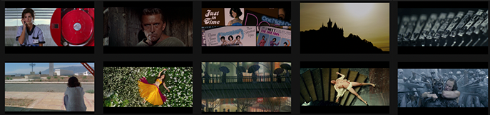

<h1 align="center">
  
  <br>
  Movie Stills
  </br>
</h1>
<h4 align="center">
A Go CLI application to scrap various websites in order to get high-quality movie snapshots. See the list of <a href="#supported-websites">Supported Websites</a>.
</h4>

<p align="center">
    <a href="https://github.com/kinoute/moviestills/actions/workflows/ci.yml">
        
    </a>
    <a href="https://goreportcard.com/report/github.com/kinoute/moviestills">
        
    </a>
    <a href="https://hub.docker.com/r/hivacruz/moviestills">
        
    </a>
</p>

## Installation

There are various ways to install or use the application:

### Binaries

Download the latest binary from the [releases](https://github.com/kinoute/moviestills/releases) page for your OS. Then you can simply execute the binary like this:

```bash
# example on linux
./moviestills --help

# You can also use environment variables 
# instead of CLI arguments
WEBSITE=blubeaver ./moviestills
```

See [Usage](#Usage) to check what settings you can pass through CLI arguments or environment variables.

### Docker images

Docker comes to the rescue, providing an easy way how to run `moviestills` on most platforms.

#### GitHub Registry

The "latest" image is built from the master branch on every push. You can see all the other tags (releases) available [here](https://github.com/kinoute/moviestills/pkgs/container/moviestills/versions).

```bash
docker run \
    --name moviestills \
    --pull=always \
    --volume "${PWD}/cache:/app/cache" \
    --volume "${PWD}/data:/app/data" \
    --rm ghcr.io/kinoute/moviestills:latest \
    --website movie-screencaps \
    --async
```

#### Docker Hub

You can can see all the image tags available on the Docker Hub [here](https://hub.docker.com/r/hivacruz/moviestills/tags?page=1&ordering=last_updated).

```bash
docker run \
    --name moviestills \
    --pull=always \
    --volume "${PWD}/cache:/app/cache" \
    --volume "${PWD}/data:/app/data" \
    --env WEBSITE=blubeaver \
    --env ASYNC=true \
    --rm hivacruz/moviestills:latest
```

As you can see, you can also use environment variables instead of CLI arguments. 

By default, the `docker run` command above will always `pull` before running to get the latest image changes for the specified tag. If you don't like this behavior, remove the `--pull=always` flag from the command.

## Usage

Output of `./moviestills --help`:

```bash
Usage: moviestills --website WEBSITE [--parallel PARALLEL] [--delay DELAY] [--async] [--cache-dir CACHE-DIR] [--data-dir DATA-DIR] [--debug] [--no-colors] [--no-style] [--hash]

Options:
  --website WEBSITE, -w WEBSITE
                         Website to scrap movie stills on [env: WEBSITE]
  --parallel PARALLEL, -p PARALLEL
                         Limit the maximum parallelism [default: 2, env: PARALLEL]
  --delay DELAY, -r DELAY
                         Add some random delay between requests [default: 1s, env: RANDOM_DELAY]
  --async, -a            Enable asynchronus running jobs [default: false, env: ASYNC]
  --cache-dir CACHE-DIR, -c CACHE-DIR
                         Where to cache scraped websites pages [default: cache, env: CACHE_DIR]
  --data-dir DATA-DIR, -f DATA-DIR
                         Where to store movie snapshots [default: data, env: DATA_DIR]
  --debug, -d            Set Log Level to Debug to see everything [default: false, env: DEBUG]
  --no-colors            Disable colors from output [default: false, env: NO_COLORS]
  --no-style             Disable styling and colors entirely from output [default: false, env: NO_STYLE]
  --hash                 Hash image filenames with md5 [default: false, env: HASH]
  --help, -h             display this help and exit
  --version              display version and exit
```

**Note**: CLI arguments will always override environment variables. Therefore, if you set `WEBSITE` as an environment variable and also use `—website` as a CLI argument, only the latter will be passed to the app.

For boolean arguments such as `--async` or `--debug`, their equivalent as environment variables is, for example, `ASYNC=false` or `ASYNC=true`.

### Cache

By default, every scraped page will be cached in the `cache` folder. You can change the name or path to the folder  through the options as listed above, with `—cache-dir` or the `CACHE_DIR` environment variable. This is an important folder as it stores everything that was scraped.

It avoids requesting again some websites pages when there is no need to. It is a nice thing as we don't want to flood these websites with thousands of useless requests. It is also handy to continue an early-stopped scraping job.

In case you are using our Docker image to run `moviestills`, don't forget to change the volume path to the new *internal* `cache` folder, if you set up a custom *internal* `cache` folder. But you should not bother editing this *internal* `cache` folder anyway, since you have volumes and can set the desired path on your host machine for the cache folder.

### Data

By default, each scraped website will have its own subfolder in the `data` folder. Inside, every movie will have its own folder with the scraped movie snapshots found on the website.

Example:

```shell
data # where to store movie snapshots
├── blubeaver # website's name
│   ├── 12\ Angry\ Men # movie's title
│   │   ├── film3_blu_ray_reviews55_12_angry_men_blu_ray_large_large_12_angry_men_blu_ray_1.jpg
│   │   ├── film3_blu_ray_reviews55_12_angry_men_blu_ray_large_large_12_angry_men_blu_ray_2.jpg
│   │   ├── film3_blu_ray_reviews55_12_angry_men_blu_ray_large_large_12_angry_men_blu_ray_3.jpg
```

You can change the default `data` folder with the `—data-dir` CLI argument or the `DATA_DIR` environment variable.

If you use our Docker image to run `moviestills`, don't forget to change the volume path in case you edited the *internal* `data` folder. Again, you should not even bother editing the *internal* `data` folder's path or name anyway as you have volumes to store and get access to these files on the host machine.

#### Hash filenames

To get some consistency, you can use the MD5 hash function to normalize image filenames. All images will then use 32 hexadecimal digits as filenames. To enable the *hashing*, use the `—hash` CLI argument or the `HASH=true` environment variable.

## Supported Websites

As today, scrapers were implemented for the following websites in `moviestills`:

| Website                                        | Simplified Name [<sup>1</sup>]() | Description                                                  | Movies [<sup>3</sup>]() |
| ---------------------------------------------- | ------------------------------- | ------------------------------------------------------------ | ---------------- |
| [BluBeaver](http://blubeaver.ca)               | blubeaver                       | Extension of [DVDBeaver](http://dvdbeaver.com), this time dedicated to Blu-Ray reviews only. Reviews are great to check the quality of BD releases with lot of technical details. Only snapshots on "free" access are scraped. | ~5069         |
| [BlusScreens](https://www.bluscreens.net)      | bluscreens                      | Website with high resolution screen captures taken directly from different Blu-ray releases by [Blusscreens](https://twitter.com/Bluscreens). | ~452             |
| [DVDBeaver](http://dvdbeaver.com)              | dvdbeaver                       | ***Not recommended***. [<sup>2</sup>]() A massive list of DVD reviews with a lot of movie snapshots. This task only includes the DVD reviews. BD snapshots are available in [BluBeaver](http://blubeaver.ca). It is advised to use the latter instead. | ~4098        |
| [EvanERichards](https://www.evanerichards.com) | evanerichards                   | A short but interesting list of movies with a lot of snapshots for each. Also includes some TV Series but they are ignored by the scraper. | ~245             |
| [Film-Grab](https://film-grab.com)             | film-grab                       | A great list of movies with a few snapshots for each. Snapshots were cherry-picked and show nice cinematography. | ~2829            |
| [HighDefDiscNews](https://highdefdiscnews.com) | highdefdiscnews                 | A few hundreds movies featured with high-quality snapshots (png, lossless) in native resolution. | ~209             |
| [Movie-Screencaps](https://movie-screencaps.com) | movie-screencaps | Website with DVD, BD, and 4K BD movie snapshots. Since thousands of snapshots are available for each movie (one per second or so), we only take some of them per paginated page. | ~715 |
| [ScreenMusings](https://screenmusings.org) | screenmusings | A small list of movies but with nice cherry-picked snapshots. | ~260 |
| [StillsFrmFilms](https://stillsfrmfilms.wordpress.com) | stillsfrmfilms | A very small list of movies but, again, the snapshots were nicely chosen and depict perfectly the atmosphere of each movie. | ~63 |

[<sup>1</sup>]() : The simplified name column displays the website's name to use with `moviestills` to start the scraping job. Eg `—website blubeaver` for the BluBeaver.ca website.

[<sup>2</sup>]() : While DVDBeaver provides a lot of movie snapshots from great DVD reviews, it is harder to filter correctly the images on the reviews pages. Expect a lot of false positives (DVD covers, banners etc) and average quality overall.

[<sup>3</sup>]() : Approximate number of movies calculated on October 5th, 2021. 

**Contribute:** If you want to fix or add a new website to the scraper, please read how to set up a [development workflow](#development) and [how to contribute](#contribute).

## Development

### Clone the repo

If you already have Go installed, you can simply clone the repo and run the application from the folder:

```bash
# clone the repo
git clone https://github.com/kinoute/moviestills

# go inside the project
cd moviestills
```

Then:

```bash
# download the dependencies
go mod download
go mod tidy

# you can run the app without compiling
go run . --help

# optional: compile the binary
go build -v

# use the compiled app (example on Linux)
./moviestills --help
```

### Docker

If you don't have Go installed, you can build a Docker Image to start developing in a Go environment. To do that, clone the repository and inside the folder:

```bash
# build development image
docker --tag moviestills-dev . \
    --target base
```

Then start and go inside the container:

```bash
# start the development container
# and go inside it
docker run \
    --name moviestills-dev \
    --volume "${PWD}:/app" \
    --interactive \
    --tty \
    --rm moviestills-dev
```

A volume is created to report any change you make to the code inside the container.

To run your code, you can use `go run .` inside the container, test it, build it etc. Do note that these commands might be slow at first.

#### Build final image

You can also build locally the final image of the app to test it. To do that, run in the repository:

```bash
# build final image with binary
docker build -t moviestills .

# test it
docker run \
    --volume "${PWD}/cache:/app/cache" \
    --volume "${PWD}/data:/app/data" \
    --rm moviestills:latest \
    --website film-grab \
    --debug 
```

## Contribute

This is my first public project in Golang. Therefore, pull requests, suggestions or bug reports are appreciated. A major refactoring is not excluded since I'm still learning the language.

A lot of things included here might look *overkill* for such a small app (linting, packages etc) but I thought setting a complete workflow would be interesting. Don't hesitate to make it better!

### Add a new website

You can contribute to this scraper by adding a new website which provides high-quality movie snapshots. To do that, there are four steps:

1. Create a new file in the `websites` folder with the *simplified* name of the website (eg. `yahoo.go`). Check how other websites were implemented and scraped with the [Colly](https://github.com/gocolly/colly) library. You need to define a main URL as a constant (the first URL that will get visited) and a main function such as `yahooScraper()` where your Colly logic will do the work.
2. Once you created a scraper for a website, you need to add this new scraper in the available options of the app in `main.go`. Edit the `sites` map by adding the *simplified* name of the website as a key and the scraper's function as a value (eg. `websites.yahooScraper`).
3. Create a unit test for the website, eg `yahoo_test.go`. For that test, we are not going to test with Colly but only with [GoQuery](https://github.com/PuerkitoBio/goquery), a library that makes HTML/CSS parsing easy, on which Colly is based. We just want to make sure the CSS selectors we use in our scraper are still up-to-date and are still filtering correctly the data we are looking for.
4. Edit the [Supported Websites](#supported-websites) table in the `README` file and write detailed informations about the website you added – please make sure websites are sorted alphabetically in the table.

## Support

Most of the websites we are scraping are owned by individuals who just want to share nice movie snapshots. **Please don't abuse these websites and limit your scraping activity to not arm them in any way.**

You can support some of the webmasters behind these nice galleries:

* The owner of DVDBeaver/BluBeaver has a Patreon page where you can support him and also get access to a lot more movie snapshots in great quality, which we don't scrap. Here is the link: https://www.patreon.com/dvdbeaver ;
* The man behind Film-Grab also has a Patreon page where you can send him some love: https://www.patreon.com/filmgrab.

I couldn't find any support page for the other websites but you can support some of them by using their affiliated links for example.

Just be gentle while scraping: some are hosting the images on their own servers!

##  Credits

* Created by [Yann Defretin](https://github.com/kinoute).
